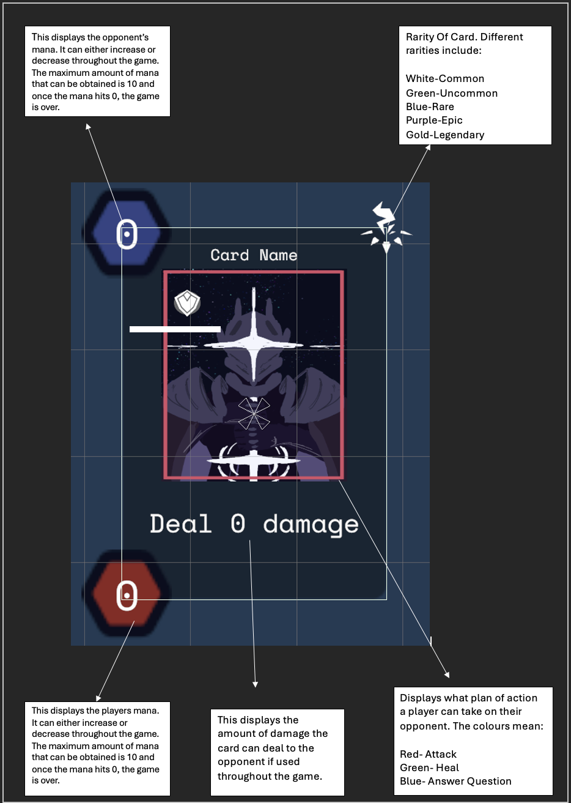

<a id="readme-top"></a>

<div align="center">
  <a href="https://github.com/M00nlightbee/Skills-Enablement-DCCG">
    
  </a>
  <h3 align="center">Skills Enablement Digital Collectible Card Game</h3>
  <p align="center">
    A strategic card game to make learning engaging and fun! <br />
    <strong>Built with Unity • Backed by IBM SkillsBuild</strong><br />
    ▶️ <a href="https://blessingu.itch.io/ibmskillbuilddccg" target="_blank"><strong>Play the Game on Itch.io</strong></a>
  </p>
</div>

---

## 📌 Table of Contents

- [About the Project](#about-the-project)
- [Key Features](#key-features)
- [Development Process](#development-process)
- [Wireframes & Design](#wireframes--design)
- [Technologies Used](#technologies-used)
- [Game Flow](#game-flow)
- [Card Anatomy & Rarity](#card-anatomy--rarity)
- [Setup & Contribution](#setup--contribution)
- [License](#license)

---
<div align="center">
  
</div>

## 🎯 About the Project

The **Skills Enablement Digital Collectible Card Game (DCCG)** is a Unity-based game that makes learning **AI, Cybersecurity, Cloud, and Data Science** fun through cards and quizzes. 🎓

Players:
- Battle using collectible cards ⚔️
- Earn cards by answering **IBM SkillsBuild** questions correctly 💡
- Level up through knowledge 📚

👉 [Project Overview](https://docs.google.com/document/d/14BMKRUqbnrAMTLlWKWsAzZeuF36g5QbhpxTpNvQdBx4/edit?usp=sharing)

---

## 🔑 Key Features

- 🎴 Turn-based card battles (like Hearthstone or Star Trek Adversaries)
- 🧠 Quiz cards test player knowledge
- ⚡ Earn mana and play special cards
- 🎨 Visual feedback like glows and animations
- 🔁 Drag-and-drop mechanics
- 📊 Health & mana UI with real-time updates

---

## 🔄 Development Process

We used Agile game dev practices:
- 📝 User stories and acceptance tests
- 🧪 Playtesting and feedback loops
- 🔄 Iterative Unity builds and sprints
- 📋 Clean, modular code with `GameManager`, `Card`, `DeckManager`, etc.

---

## 🧪 Wireframes & Design

We planned every screen first with wireframes:
- 🎮 Menu & Game Board
- 🃏 Deck Builder and Card Info
- 📊 Victory/Defeat screens
- ❓ Integrated Quiz Scene

▶️ [View Figma Wireframes](https://www.figma.com/proto/6WOWbbwzxDDswA4TzgWmtG/Game-Prototype?page-id=0%3A1&node-id=41-977&p=f&viewport=214%2C-45%2C0.13&scaling=contain&content-scaling=fixed&starting-point-node-id=41%3A977)

---

## 🧰 Technologies Used

- 🎮 **Unity Engine** – game mechanics and UI
- 🖥️ **Visual Studio** – C# scripting
- ☁️ **IBM SkillsBuild** – question content
- 🧪 **Unity Test Framework** – unit tests
- 🖼️ **Figma** – UI/UX design
- 🌐 **GitHub** – version control and project tracking

---

## 🎮 Game Flow

### 🧍 Player Journey
1. Load the game and pick a category (AI, Cybersecurity, etc.)
2. Answer a quiz to earn new cards 💬
3. Use cards to battle AI opponents 🤖
4. Keep winning and collecting for a stronger deck 🏆

### 🎲 Core Mechanics
- Turn-based gameplay
- Drag to play cards: Attack, Heal, or open a Quiz
- Health system for player/opponent
- Mana required to play stronger cards
- Cards are rewarded based on quiz performance

---

## 🃏 Card Anatomy & Rarity

Here’s what each part of a card means:

<div align="center">
  
</div>

### 🔍 Card Breakdown

- **Opponent's Mana (Top Left)**  
  Shows how much energy the opponent has left. Starts at 10. When it hits 0, they lose!

- **Player's Mana (Bottom Left)**  
  Your energy level! You need mana to play cards. Starts at 10, game ends if it drops to 0.

- **Card Name (Top Center)**  
  Every card has a cool name — like “Cyber Firewall” or “AI Strike”.

- **Card Image (Middle)**  
  The visual of the card — sometimes a hero, a shield, or a starship.

- **Card Effect (Bottom Center)**  
  Shows what the card does, like “Deal 3 Damage” or “Heal 2 Health”.

- **Card Action Type (Bottom Right Color Dot)**  
  What this card does:
  - 🔴 **Red** = Attack
  - 🟢 **Green** = Heal
  - 🔵 **Blue** = Answer a Quiz Question

- **Card Rarity (Top Right Icon Color)**  
  How rare the card is:
  - ⚪ **White** – Common  
  - 🟢 **Green** – Uncommon  
  - 🔵 **Blue** – Rare  
  - 🟣 **Purple** – Epic  
  - 🟡 **Gold** – Legendary

---

## 🛠️ Setup & Contribution

```bash
# Clone the repo
git clone https://github.com/M00nlightbee/Skills-Enablement-DCCG.git

# Open in Unity (version X.X.XfX)
# Run the main scene to play
